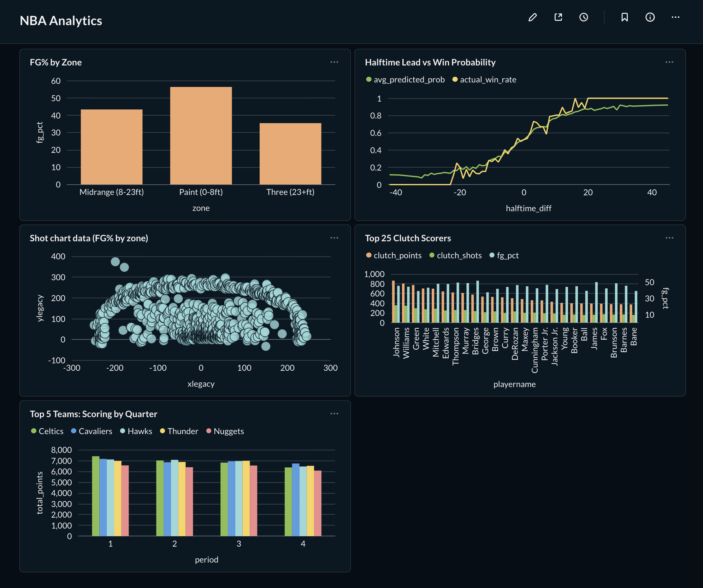

# NBA Data Pipeline

## Overview
An automated ETL pipeline that extracts NBA play-by-play data for every regular season game using the nba_api package, transforms and loads it into a PostgreSQL database hosted on AWS RDS, and stores raw JSON files in S3. The pipeline runs serverlessly on AWS Lambda, triggered daily by EventBridge, with CloudWatch monitoring and SNS email alerts for error handling. Includes a halftime prediction model (73% accuracy) and a Metabase dashboard for visualization.

## Architecture
- Extract runs locally (NBA API blocks AWS IPs) on a daily schedule via macOS launchd, pulling play-by-play JSON and uploading to S3
- EventBridge triggers the Lambda function daily at midnight PT to transform and load new data
- Lambda reads raw JSON from S3, transforms play-by-play data, and bulk loads into PostgreSQL via `COPY`
- A Random Forest model predicts home team win probability using only halftime data
- Metabase connects to RDS for live dashboarding
- CloudWatch monitors Lambda executions and SNS sends email alerts on failures

## Tech Stack
- Python 3.9
- PostgreSQL 17
- AWS (S3, Lambda, RDS, EventBridge, CloudWatch, SNS, IAM, ECR)
- nba_api (Python package for NBA.com stats)
- scikit-learn (Logistic Regression, Random Forest)
- Docker (arm64 for Apple Silicon)
- Metabase (dashboarding)
- Claude Code (AI pair programming)

## Project Structure
- `extract.py` — Local extraction script that pulls play-by-play data from the NBA API and uploads JSON to S3
- `transform.py` — Reads raw JSON from S3, extracts and cleans play-by-play actions, outputs CSV
- `load.py` — Reads CSV and bulk loads into PostgreSQL using `COPY`
- `lambda_function.py` — Lambda function that orchestrates transform and load in batches of 100 games
- `schema.sql` — PostgreSQL table definition for the `nba_data` table
- `analysis.ipynb` — Halftime prediction model: feature engineering, training, evaluation, and prediction export
- `Dockerfile` — Lambda deployment image (arm64)
- `requirements.txt` — Python dependencies

## AWS Services
| Service | Purpose |
|---------|---------|
| S3 | Stores raw play-by-play JSON files per game (`{season}/{gameId}.json`) |
| Lambda | Runs transform and load serverlessly in batches |
| ECR | Hosts the Docker image for Lambda deployment |
| RDS | Hosts the PostgreSQL database |
| EventBridge | Schedules Lambda daily at midnight PT |
| CloudWatch | Monitors Lambda logs, metrics, and triggers alarms on errors |
| SNS | Sends email notifications when the CloudWatch alarm fires |
| IAM | Manages permissions for the pipeline user and Lambda execution role |

## Database Schema
```sql
CREATE TABLE nba_data (
    gameId VARCHAR(20),
    actionId INTEGER,
    period INTEGER,
    clock VARCHAR(10),
    teamTricode VARCHAR(5),
    personId INTEGER,
    playerNameI VARCHAR(50),
    location VARCHAR(5),
    actionType VARCHAR(50),
    subType VARCHAR(50),
    descriptor VARCHAR(50),
    description TEXT,
    shotDistance DECIMAL(5, 2),
    shotResult VARCHAR(10),
    isFieldGoal INTEGER,
    scoreHome INTEGER,
    scoreAway INTEGER,
    pointsTotal INTEGER,
    assistPersonId INTEGER,
    PRIMARY KEY (gameId, actionId)
);
```

## Prediction Model
- **Goal:** Predict whether the home team wins using only first-half data
- **Features (20):** Halftime scores/differential, Q1 scores/differential, scoring momentum, FG% by shot zone (paint, midrange, three), shot distribution by zone
- **Models:** Logistic Regression (73% test accuracy), Random Forest (73% test accuracy)
- **Key finding:** Halftime score differential is the dominant predictor at 34% feature importance
- **Export:** Predictions written to a `halftime_predictions` table in Postgres for Metabase dashboarding

## Metabase Dashboard


Five charts connected to the live PostgreSQL database:
1. FG% by Zone (bar)
2. Halftime Lead vs Win Probability (line)
3. Shot Chart (scatter)
3. Top 25 Clutch Scorers (bar)
4. Top 5 Teams: Scoring by Quarter (bar)

## Setup
1. Clone the repository
2. Create a virtual environment and install dependencies: `pip install -r requirements.txt`
3. Configure AWS CLI with appropriate IAM credentials
4. Create an S3 bucket for storing JSON files
5. Create an RDS PostgreSQL instance and run `schema.sql` to create the table
6. Set environment variables for database connection (`DB_HOST`, `DB_NAME`, `DB_USER`, `DB_PASSWORD`, `DB_PORT`)
7. Run `extract.py` locally to pull play-by-play data into S3
8. Build and push the Docker image to ECR: `docker build --platform linux/arm64 --provenance=false -t nba-data-pipeline .`
9. Deploy the Lambda function pointing to the ECR image
10. Create an EventBridge rule with a cron schedule to trigger Lambda daily
11. Set up CloudWatch alarms and SNS topic for error notifications
12. (Optional) Run Metabase via Docker and connect to RDS for dashboarding
